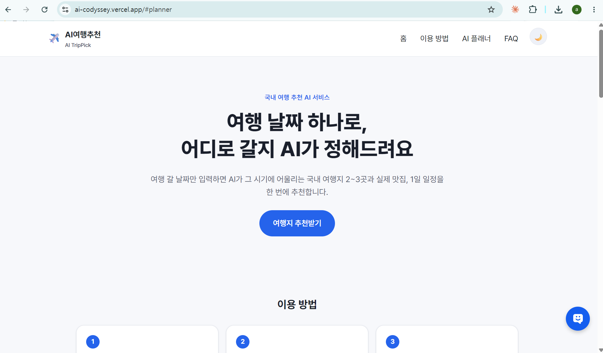
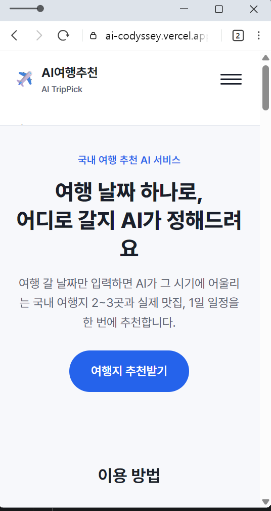
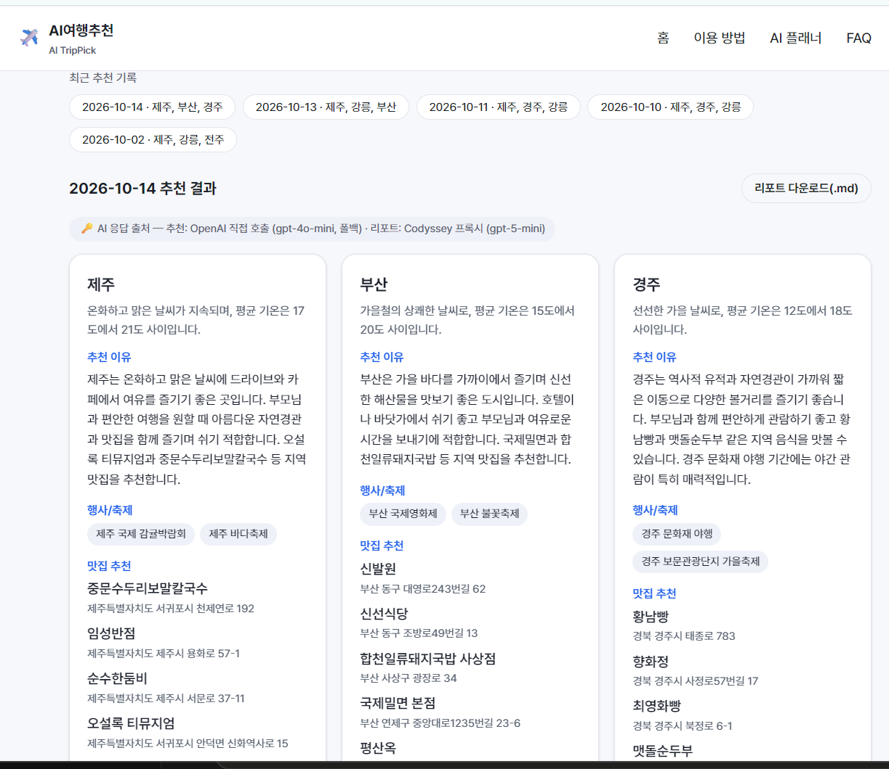

# AI여행추천 (AI TripPick)

여행 날짜를 입력하면 AI가 그 시기에 어울리는 국내 여행지 2~3곳을 추천하고, 카카오 로컬 API로 지역별 실제 맛집을 찾은 뒤, 지역별 1일 일정까지 정리해 주는 웹 서비스다.

- **배포 URL**: https://ai-codyssey.vercel.app
- **GitHub 저장소**: https://github.com/andrewjung376/ai-codyssey (이 폴더: `A1-3/`)

## 배포 확인 스크린샷

배포된 서비스가 실제로 동작하는 화면이다. 원본 파일은 [`submission/screenshots/`](submission/screenshots/)에 있다.

| 데스크톱 | 모바일 | AI 기능 동작(추천 결과) |
|---|---|---|
|  |  |  |

- 반응형은 모바일(≈375~536px)과 데스크톱(≈1440~1883px) 두 화면 크기에서 직접 확인했다(위 스크린샷). CSS 자체는 `css/style.css`에 태블릿 분기(768px)까지 정의되어 있다.
- AI 기능 동작 스크린샷에는 실제 추천 결과와 함께, 어떤 AI 경로(Codyssey 프록시 / OpenAI 폴백)로 응답했는지 보여주는 "🔑 AI 응답 출처" 배지도 함께 보인다.

## 서비스 소개

- **목적**: 여행 갈 날짜는 정했지만 어디로 갈지 못 정한 사람에게, 시기(날씨·축제)에 맞는 국내 여행지와 실제 맛집, 1일 일정을 한 번에 추천한다.
- **타겟 사용자**: 여행 날짜는 정했지만 행선지를 못 정한 20~40대 직장인
- **핵심 기능**
  1. 날짜(+선택적 여행 취향) 기반 AI 여행지 추천 2~3곳
  2. 지역별 실제 맛집 검색(카카오맵 링크 포함)
  3. 지역별 1일 일정 제안
  4. 결과를 Markdown 리포트로 다운로드
  5. 같은 날짜로 재검색 시 브라우저 캐시를 재사용해 API 호출 절감
- 자세한 서비스 기획(목적/타겟/페이지 구성/AI 기능 입출력·실패 처리 기준)은 [`submission/service-plan.md`](submission/service-plan.md) 참고.

## 페이지 구성

단일 페이지(`index.html`) 안에서 해시 링크로 이동하는 4개 섹션(모바일은 햄버거 메뉴):

| 섹션 | 내용 |
|---|---|
| 홈(`#home`) | 서비스 소개, "여행지 추천받기" 버튼 |
| 이용 방법(`#how`) | 추천 → 맛집 → 일정 3단계 설명 |
| AI 플래너(`#planner`) | 입력 폼 + 추천 결과(핵심 AI 기능) |
| FAQ(`#faq`) | 데이터 출처, 한계, 재추천 방법 안내 |

## 기술 스택

- **프론트엔드**: 순수 HTML / CSS / JavaScript (프레임워크 미사용)
- **백엔드**: Vercel Serverless Functions (Python, `api/`)
- **AI API**: [Codyssey 과정 제공 OpenAI 호환 프록시](https://copa.codyssey.kr)(`gpt-5-mini`, 1순위) → 실패 시 OpenAI 공식 API(`gpt-4o-mini`, 2순위 폴백)
- **외부 API**: Kakao Local API (맛집 검색)
- **배포**: Vercel (GitHub 연동, 자동 배포)

### 프론트엔드 3요소의 역할

| 기술 | 역할 | 이 프로젝트에서의 예 |
|---|---|---|
| HTML (`index.html`) | 화면의 뼈대와 의미(구조) | `<section id="planner">` 안에 입력 폼(`<form id="plannerForm">`)과 결과 영역(`<div id="resultArea">`)을 배치 |
| CSS (`css/style.css`) | 레이아웃과 시각적 스타일, 반응형/다크모드 | `@media (min-width: 768px)`로 태블릿 이상에서 카드 그리드를 2~3열로 전환 |
| JavaScript (`js/app.js`) | 사용자 입력 처리, 서버와의 통신, 화면 갱신 | 폼 제출 시 `fetch('/api', ...)`로 날짜/취향을 보내고, 응답을 받아 `renderResults()`로 카드 DOM을 생성 |

### 핵심 파일 역할

| 파일 | 핵심 함수/객체 | 역할 |
|---|---|---|
| `api/index.py` | `class handler`, `_handle()` | 유일한 Vercel 진입점. 요청 본문의 `action`으로 recommend/report 라우팅 |
| `api/_core.py` | `handle_recommend()`, `handle_report()`, `call_llm()` | 입력 검증, AI 프롬프트 구성, Codyssey/OpenAI 호출과 폴백, Kakao 맛집 검색, Markdown 리포트 조립 |
| `api/_http.py` | `read_json_body()`, `send_json()`, `handle_errors()` | HTTP 요청 파싱, JSON 응답 전송, 예외를 HTTP 상태 코드로 매핑 |
| `js/app.js` | `runPlanner()`, `postJson()`, `renderResults()` | 폼 검증, `fetch` 호출(타임아웃/지연 안내 포함), 결과 카드 렌더링, `localStorage` 캐시 |
| `css/style.css` | 미디어 쿼리, `[data-theme]` | 반응형 분기(768px/1024px), 라이트/다크 테마 변수 |

## 프로젝트 구조

```
A1-3/
├─ index.html            # 메인 페이지 (홈/이용방법/AI플래너/FAQ)
├─ css/style.css         # 반응형 스타일(모바일 우선, 768px/1024px 분기), 다크모드
├─ js/app.js             # 네비게이션, 폼 검증, fetch 호출, 결과 렌더링, 캐시
├─ images/               # 파비콘 등 정적 이미지
├─ api/
│  ├─ index.py           # 단일 진입점 (POST /api, action으로 recommend/report 라우팅)
│  ├─ _core.py           # 검증·프롬프트·AI/Kakao 호출 등 핵심 로직
│  └─ _http.py           # HTTP 요청 파싱/응답/예외→상태코드 매핑 공통 로직
├─ requirements.txt      # openai, requests, python-dotenv
├─ vercel.json           # Serverless Function 설정(maxDuration)
├─ .env.example          # 필요한 환경 변수 이름
└─ submission/           # 제출 증빙(서비스 기획서, 스크린샷, AI 사용 로그)
```

> `api/index.py` 하나만 있는 이유: Vercel Python 런타임이 프로젝트를 하나의 애플리케이션으로 빌드하며 진입점을 하나만 자동 인식하기 때문이다. 파일마다 별도 엔드포인트를 두던 초기 구조에서 이 방식으로 바꾼 배경은 아래 "배포 중 겪은 문제" 참고.

## AI 기능 (입력 → 출력 → 실패 처리)

| 구분 | 내용 |
|---|---|
| 입력 | 여행 날짜(필수, 오늘 이후) + 여행 취향(선택, 200자 이내) |
| 출력 | 여행지 2~3곳(날씨/행사/추천 이유), 지역별 맛집 최대 5곳(카카오맵 링크 포함), 지역별 1일 일정(오전/오후/저녁), Markdown 리포트 다운로드 |
| 실패 처리 | 빈 입력·형식 오류 → 400 인라인 안내 / API 오류 → 502 + 재시도 버튼 / 8초 경과 시 지연 안내 / 30초~55초 경과 시 타임아웃 안내 |

`POST /api`에 `{"action": "recommend", ...}` 또는 `{"action": "report", ...}`로 요청하면, 어떤 AI 키 경로(Codyssey 프록시 또는 OpenAI 폴백)로 응답했는지 `ai_key_source` 값이 함께 오고, 화면 결과에도 표시된다.

### 요청 처리 흐름 (상태 전이)

```
[폼 제출]
   │
   ▼
버튼 비활성화 + 로딩 스켈레톤 표시 (중복 요청 방지)
   │
   ├─ localStorage에 같은 날짜+취향 캐시가 있으면 → recommend 호출 생략
   │
   ▼
POST /api {action:"recommend"} ──(8초 경과)──▶ "조금 더 걸리고 있어요…" 안내
   │
   ├─ 실패(4xx/5xx) ──▶ 상태 메시지 표시 + [다시 시도] 버튼, 버튼 재활성화 (종료)
   │
   ▼ 성공
POST /api {action:"report"} ──(8초 경과)──▶ "리포트를 정리하고 있어요…" 안내
   │
   ├─ 실패 또는 55초 타임아웃 ──▶ 상태 메시지 표시 + [다시 시도] 버튼 (종료)
   │
   ▼ 성공
결과 카드 렌더링 + "최근 추천 기록" 저장 + 버튼 재활성화 + "새로 추천받기" 버튼 노출
```

### API 요청/응답 예시 (실제 배포 URL에서 확인)

**[1/2] 여행지 추천 — 성공**

```
POST https://ai-codyssey.vercel.app/api
Content-Type: application/json

{"action": "recommend", "date": "2026-12-24", "preference": "부모님과, 걷기 적은 일정으로"}
```

```json
{
  "recommended_cities": [
    {
      "city": "제주",
      "weather": "12월 제주도는 비교적 온화한 편이며, 기온은 약 5도에서 10도 사이로 유지됩니다.",
      "events": ["제주 겨울 바다 축제", "제주 크리스마스 마켓"],
      "reason": "제주는 겨울에도 따뜻한 날씨로 부모님과 함께 여행하기에 적합합니다...",
      "restaurants": [
        {
          "name": "중문수두리보말칼국수",
          "address": "제주특별자치도 서귀포시 천제연로 192",
          "category": "음식점 > 한식 > 국수 > 칼국수",
          "url": "http://place.map.kakao.com/1148098112"
        }
      ]
    }
  ],
  "errors": [],
  "ai_key_source": "openai"
}
```

**[2/2] 리포트 생성 — 성공** (위 응답을 그대로 이어서 요청)

```json
// 요청: {"action": "report", "date": "2026-12-24", "recommended_cities": [...], "errors": []}
{
  "cities": [
    {
      "city": "제주",
      "summary": "제주는 겨울에도 비교적 온화해 부모님과 함께 걷기 좋은 관광 코스가 많아 편안한 여행에 적합합니다...",
      "schedule": {
        "morning": "제주 도착 후 해안도로나 산책로에서 겨울 바다를 감상하며 가벼운 산책을 합니다...",
        "afternoon": "오후에는 제주 크리스마스 마켓이나 섭지코지 등 근교 관광지를 둘러봅니다...",
        "evening": "저녁에는 가족이 함께 먹기 좋은 고깃집에서 식사하고 숙소 근처에서 휴식을 취합니다..."
      }
    }
  ],
  "markdown": "# 2026-12-24 국내 여행 추천 리포트\n\n## 지역별 추천\n\n### 제주\n- 날씨: ...\n- 맛집 추천:\n  - [중문수두리보말칼국수](http://place.map.kakao.com/1148098112) - 제주특별자치도 서귀포시 천제연로 192\n...",
  "ai_key_source": "cody"
}
```

**오류 응답 예시**

```json
// 빈 입력(날짜 없음) → 400
POST /api {"action": "recommend"}
→ {"error": "여행 날짜를 입력해 주세요."}

// 여행 취향 201자 → 400
POST /api {"action": "recommend", "date": "2026-12-01", "preference": "가...가"(201자)}
→ {"error": "여행 취향은 200자 이내로 입력해 주세요."}

// AI 응답 실패(양쪽 경로 모두) → 502
→ {"error": "AI 응답을 받지 못했어요. 잠시 후 다시 시도해 주세요."}
```

### 테스트 케이스 (실제 배포 URL에서 확인)

| 입력 | 기대 동작 | 실제 결과 |
|---|---|---|
| 정상 입력: `2026-12-24` / "부모님과, 걷기 적은 일정으로" | 추천 결과가 화면에 표시됨 | ✅ 제주/강릉/부산 3곳 + 맛집 + 일정 정상 표시 (위 예시 응답) |
| 빈 입력: 날짜 없음 | "필수값을 입력하세요" 계열 안내 | ✅ 400, `{"error": "여행 날짜를 입력해 주세요."}` |
| 긴 입력: 여행 취향 201자(200자 제한 초과) | 응답이 표시되거나 지연 시 안내 | ✅ 400, `{"error": "여행 취향은 200자 이내로 입력해 주세요."}` (프론트에서도 글자 수 카운터로 사전 차단) |

## 로컬 실행 방법

### 1. 가상환경 생성 및 의존성 설치

```bash
python -m venv .venv
.\.venv\Scripts\Activate.ps1      # Windows
# source .venv/bin/activate       # macOS/Linux

pip install -r requirements.txt
```

### 2. 환경 변수 설정

`.env.example`을 복사해 `.env`를 만들고 값을 채운다.

```bash
cp .env.example .env
```

```
CODY_OPENAI_API_KEY=여기에_Codyssey_프록시용_키
OPENAI_API_KEY=여기에_OpenAI_키(폴백용, 선택)
KAKAO_REST_API_KEY=여기에_Kakao_REST_API_키
```

- `CODY_OPENAI_API_KEY`, `OPENAI_API_KEY` 중 **최소 하나**는 있어야 한다 (하나만 있어도 동작).
- Kakao REST API 키: https://developers.kakao.com 에서 애플리케이션 생성 후 발급(REST API 키 사용, 카카오맵/로컬 서비스 활성화 필요)

### 3. 로컬 서버 실행

정식 배포 환경은 Vercel Serverless Functions이지만, 로컬에서는 Vercel 계정 로그인 없이도 동일한 `api/` 로직을 그대로 실행하는 개발 서버 스크립트를 쓴다.

```bash
python scripts/dev_server.py 3000
```

브라우저에서 http://localhost:3000 접속.

## 배포 방법 (Vercel)

1. https://vercel.com 접속 → GitHub 계정으로 로그인
2. "Add New... → Project" → `andrewjung376/ai-codyssey` 저장소 Import
3. **Root Directory**를 `A1-3`으로 지정 (지정하지 않으면 저장소 최상위를 배포하려다 실패함)
4. **Framework Preset**을 `Other`로 지정 (자동 감지된 `Python` 프리셋을 쓰면 정적 파일까지 Python 함수로 라우팅되어 실패함 — 아래 "배포 중 겪은 문제" 참고)
5. **Environment Variables** 등록 (프로젝트 화면 → Settings → Environment Variables, 또는 최초 Import 화면의 "Environment Variables" 섹션)
   - 이름(Key)과 값(Value)을 한 쌍씩 입력: `CODY_OPENAI_API_KEY`, `OPENAI_API_KEY`, `KAKAO_REST_API_KEY`
   - 적용 범위(Environment)는 **Production을 반드시 체크** (Preview만 체크하면 실제 배포 URL에는 적용되지 않는다)
   - 값을 저장한 뒤 이미 배포가 있다면 **Redeploy**해야 새 값이 반영된다 (환경 변수 변경은 자동 재배포를 트리거하지 않음)
6. Deploy 클릭 → 몇 분 내 배포 URL 발급, 이후 `main` 브랜치에 push할 때마다 자동 재배포

## 배포 중 겪은 문제와 해결 (요약)

배포 과정에서 실제로 겪은 오류와 해결 방법을 기록한다. 자세한 원인 분석은 이 프로젝트의 개발 대화 로그([`submission/ai-log/`](submission/ai-log/)) 참고.

| 문제 | 원인 | 해결 |
|---|---|---|
| 빌드 실패: "No python entrypoint found ... found potential entrypoints" | `api/`에 `handler`를 내보내는 파일이 2개(`recommend.py`, `report.py`)라 Vercel이 진입점을 하나로 특정하지 못함 | `api/index.py` 하나로 통합, 요청 본문의 `action` 필드로 내부 라우팅 |
| 배포 후 모든 요청 500: `ModuleNotFoundError: No module named '_core'` | Vercel이 `api/index.py`를 개별 모듈로 로드하며 같은 폴더를 `sys.path`에 자동으로 넣어주지 않음 | `api/index.py` 상단에서 자기 자신의 디렉터리를 `sys.path`에 직접 추가 |
| `GET /`까지 Python 함수로 라우팅되어 실패 | `requirements.txt` 존재만으로 Vercel이 "Python 프레임워크"로 자동 인식해, 정적 파일까지 전부 그 함수로 밀어넣음 | 프로젝트 설정에서 **Framework Preset을 `Other`로 변경** |
| `POST /api` 504 (60초 타임아웃) | 1순위 AI 프록시가 느릴 때(~28초) 검증 실패 재시도가 프록시를 한 번 더 시도해 예산 초과 | 재시도 시에는 프록시를 건너뛰고 바로 폴백(OpenAI)으로 감 |
| 다운로드 리포트에 맛집 링크 누락 | 다운로드용 Markdown 전체를 AI 자유 텍스트로 생성해 링크가 가끔 빠짐 | AI에는 요약/일정만 요청하고, Markdown은 서버가 보유한 실제 카카오 데이터로 직접 조립 |

<details>
<summary>실제 Vercel 로그 원문 (빌드/런타임 에러)</summary>

**빌드 실패 로그** (Vercel 빌드 로그에서 발췌):
```
Error: No python entrypoint found in default locations, but found potential entrypoints:
  api/recommend.py (variable: handler)
  api/report.py (variable: handler)

Add this to your pyproject.toml:

[tool.vercel]
entrypoint = "api.recommend:handler"
```

**런타임 500 로그** (Vercel Runtime Logs, `get_runtime_logs`로 확인):
```
could not import "api/index.py":
Traceback (most recent call last):
  File "/var/task/_vendor/vercel_runtime/vc_init.py", line 622, in <module>
    __vc_module = import_module(_entrypoint_modname, _entrypoint_abs)
  ...
  File "/var/task/api/index.py", line 23, in <module>
    from _core import ValidationError, handle_recommend, handle_report
ModuleNotFoundError: No module named '_core'
```

**런타임 504 로그** (재시도 시 Cody 프록시를 또 시도하던 구버전):
```
HTTP Request: POST https://api.openai.com/v1/chat/completions "HTTP/1.1 200 OK"
Vercel Runtime Timeout Error: Task timed out after 60 seconds
[cody proxy failed, falling back to OPENAI_API_KEY] HTTPSConnectionPool(host='copa.codyssey.kr', port=443): Read timed out. (read timeout=28)
```
(OpenAI 응답 자체는 200으로 성공했지만, 그 전에 Cody 프록시 타임아웃을 두 번 겪으며 Vercel의 60초 제한을 넘겨 요청 자체가 강제 종료됨)

**Framework Preset 변경의 영향 범위**: `requirements.txt`가 있으면 Vercel이 `Python` 프리셋을 자동 선택하고, 이 프리셋은 모든 요청(정적 파일 포함)을 단일 Python 애플리케이션으로 라우팅한다. `Other`로 바꾸면 원래 의도한 "정적 파일은 정적 파일대로 서빙 + `api/`는 파일 기반 서버리스 함수"로 동작한다. 이 변경은 Vercel 프로젝트 설정값이라 코드 변경은 필요 없다.

</details>

## 오류 처리 요약

| 상황 | 동작 |
|---|---|
| 필수 입력 누락/형식 오류 | 프론트에서 인라인 오류 메시지 (400) |
| API 키 미설정 | 500 + "서비스 설정 오류입니다" (키 값은 로그에도 남기지 않음) |
| AI 응답 실패(양쪽 경로 모두) | 502 + 재시도 버튼 |
| Kakao 검색 실패/0건 | 해당 지역만 "데이터 없음"으로 표시, 나머지는 정상 진행 |
| 응답 지연 | 8초 경과 시 지연 안내, 55초 경과 시 타임아웃 안내 |

### 지연/타임아웃 사용자 시나리오 상세

1순위 AI 경로(Codyssey 프록시)가 느릴 수 있어(실측 25~28초) 아래처럼 단계별로 안내한다.

| 경과 시간 | 사용자에게 보이는 것 | 내부 동작 |
|---|---|---|
| 0~8초 | 로딩 스켈레톤만 표시 | 서버에서 1순위(Cody) 응답 대기 중 |
| 8초 | "조금 더 걸리고 있어요… AI가 여행지를 고르고 있습니다." (`js/app.js`의 `SLOW_WARNING_MS`) | 요청은 계속 진행 중, 취소하지 않음 |
| ~28초(서버) | (화면 변화 없음) | 서버가 Cody를 포기하고 OpenAI 폴백으로 전환(`CODY_TIMEOUT_SECONDS`) |
| 55초 | "응답이 너무 늦어요. 다시 시도해 주세요." + [다시 시도] 버튼 | 프론트가 `AbortController`로 요청을 강제 중단(`REQUEST_TIMEOUT_MS`) |
| (서버측) 60초 | — | Vercel 함수 자체가 강제 종료(`vercel.json`의 `maxDuration`). 정상 흐름에서는 55초 프론트 타임아웃이 먼저 걸리므로 도달하지 않도록 설계함 |

## 캐시 정책

- **저장 위치**: 서버가 아니라 **브라우저 `localStorage`** (Vercel Serverless Function은 상태를 유지하지 않으므로 서버 캐시가 불가능하다).
- **캐시 대상**: `POST /api`(action=recommend)의 응답만 캐시한다. 리포트(action=report)는 캐시하지 않고 매번 새로 생성한다(맛집 데이터가 바뀌지 않아도 일정 문구는 재생성해도 무방하기 때문).
- **캐시 키**: `date + preference` 조합. 같은 날짜라도 취향 문구가 다르면 다른 캐시로 취급한다.
- **유효기간(TTL)**: 없음(무기한). 여행 날짜 자체가 자연스러운 만료 기준이 되고, 사용자가 "새로 추천받기" 버튼으로 언제든 캐시를 무시하고 재생성할 수 있어 별도 TTL을 두지 않았다.
- **한계**: 브라우저별로 캐시가 분리되고, 시크릿 모드에서는 매번 새로 호출된다. 여러 사용자가 같은 날짜를 조회해도 캐시가 공유되지 않는다(서버 캐시가 아니므로).

## 운영 체크리스트

### API 키 교체 절차

1. 새 키를 발급한다 (Codyssey/OpenAI/Kakao 각 발급처에서).
2. Vercel 대시보드 → Settings → Environment Variables에서 해당 키 값을 새 값으로 교체하고 **Production 환경 체크를 확인**한다.
3. Deployments 탭에서 최신 배포를 **Redeploy**한다(환경 변수 변경은 자동 재배포되지 않는다).
4. 배포 URL에서 실제 요청을 보내 `ai_key_source` 값과 정상 응답을 확인한다.
5. 이전 키는 발급처에서 **폐기(revoke)**한다.

### 키 유출 의심 시 확인 절차

1. **로그 확인**: Vercel 대시보드 → 프로젝트 → Logs(Runtime Logs)에서 짧은 시간에 비정상적으로 많은 요청이 들어왔는지, `AUTH_ERROR`/`401`/`429` 같은 응답이 급증했는지 확인한다.
2. **git 히스토리 확인**: `git log -p -- A1-3/.env` 등으로 실수로 `.env`가 커밋된 적이 있는지 확인한다(이 프로젝트는 `.gitignore`로 막혀 있어 정상적으로는 커밋되지 않는다).
3. **즉시 조치**: 의심되는 키를 발급처(OpenAI/Codyssey/Kakao)에서 즉시 폐기하고 위 "API 키 교체 절차"로 새 키를 발급·교체한다.
4. **커밋 이력 정리**: 만약 키가 커밋 이력에 남아 있다면(`git log -S "sk-"` 등으로 검색), `git filter-repo` 또는 GitHub의 저장소 히스토리 정리 절차로 제거한다.

## 확장 가이드

새 AI 기능이나 엔드포인트를 추가할 때 권장하는 구조:

- **새 액션 추가**(예: `action: "compare"`): `api/_core.py`에 `handle_compare(payload)` 함수를 추가하고, `api/index.py`의 `_handle()`에 분기 하나만 추가한다. HTTP 파싱/응답 로직(`api/_http.py`)은 그대로 재사용된다.
- **새 외부 API 연동**: `api/_core.py`에 `call_xxx_api()` 형태로 얇은 래퍼 함수를 추가하고, 키는 `load_api_keys()`에서 함께 검증하도록 확장한다.
- **새로운 정적 페이지/섹션**: `index.html`에 `<section id="...">`를 추가하고 `js/app.js`의 네비게이션 로직(해시 링크 처리)은 이미 범용적이라 별도 수정이 거의 필요 없다.
- **테스트**: 이 프로젝트는 별도 테스트 프레임워크 없이, 네트워크 호출을 모킹한 스크립트로 `api/_core.py`의 순수 함수(검증 로직 등)를 검증했다(개발 중 임시 스크립트, 저장소에는 포함하지 않음). 실제 프레임워크(pytest 등)를 도입한다면 `api/_core.py`의 함수들이 이미 HTTP와 분리되어 있어 그대로 단위 테스트하기 쉽다.

## 보너스 과제 반영 현황

| 보너스 항목 | 상태 | 비고 |
|---|---|---|
| 사용자 경험(UX) 고도화 (다크모드/마이크로 인터랙션/방문자 분석 중 1개 이상) | ✅ 반영 | 다크 모드(`prefers-color-scheme` 자동 감지 + 수동 토글, `localStorage` 저장) + 마이크로 인터랙션(결과 카드 순차 등장 애니메이션, 로딩 스켈레톤) 2가지 구현 |
| 운영 자동화/데이터 저장 고도화 (외부 도구·저장소 연동) | ⬜ 미반영 | 선택 과제. 현재 캐싱은 브라우저 `localStorage`(클라이언트 로컬)만 사용하며, 외부 저장소·노코드 자동화 연동은 하지 않았다 |

## 보안 주의사항

- API 키는 코드에 직접 작성하지 않고 환경 변수로만 관리한다.
- `.env` 파일은 `.gitignore`에 등록되어 있어 git에 커밋되지 않는다.
- 키가 노출되었다면 즉시 재발급하고 커밋 히스토리도 정리한다(위 "운영 체크리스트" 참고).

## 제출 패키지 파일 목록

| 파일 | 내용 |
|---|---|
| [`submission/service-plan.md`](submission/service-plan.md) | 서비스 기획서 (목적/타겟/페이지 구성/AI 기능 입출력·실패 처리 기준) |
| [`submission/screenshots/desktop-home.png`](submission/screenshots/desktop-home.png) | 데스크톱 화면 스크린샷 |
| [`submission/screenshots/mobile-home.png`](submission/screenshots/mobile-home.png) | 모바일 화면 스크린샷 |
| [`submission/screenshots/ai-feature-result.png`](submission/screenshots/ai-feature-result.png) | AI 기능 동작(추천 결과) 스크린샷 |
| [`submission/ai-log/dialogue-log.md`](submission/ai-log/dialogue-log.md) | AI 코딩 도구(Claude Code) 사용 대화 전체 로그 |

## 개발 환경

- Python 3.10 이상
- 의존성: `openai`, `requests`, `python-dotenv` (`requirements.txt` 참고)
- AI 코딩 도구를 활용해 개발했다. 사용 과정은 [`submission/ai-log/`](submission/ai-log/) 참고.
