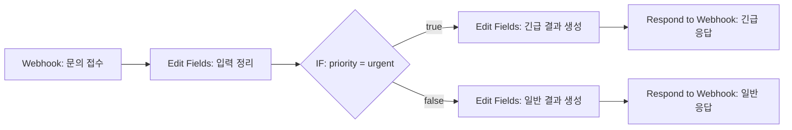
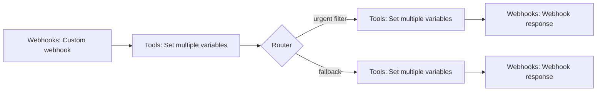

# 프로젝트 1 설계서 — 고객 문의 우선순위 자동 분류 및 응답

## 1. 자동화 대상

고객 문의가 접수될 때 담당자가 내용을 확인하고 긴급 여부를 판단한 뒤 접수 결과를 회신하는 반복 업무를 자동화한다.

## 2. 공통 입력 형식

```json
{
  "ticket_id": "T-001",
  "requester": "테스트고객",
  "priority": "urgent",
  "subject": "결제 오류",
  "message": "결제가 중복으로 처리되었습니다."
}
```

민감정보 노출을 피하기 위해 테스트에서는 실명과 실제 이메일을 사용하지 않는다.

## 3. 분기 조건

- 긴급 경로: `priority`가 `urgent`와 같음
- 일반 경로: 위 조건에 해당하지 않는 나머지 값

## 4. 공통 출력 형식

```json
{
  "ticket_id": "T-001",
  "route": "URGENT",
  "sla": "1시간 이내",
  "message": "긴급 문의로 접수되었습니다."
}
```

## 5. n8n 구현



노드 구성:

| 구분 | n8n 노드 | 역할 |
|---|---|---|
| Trigger | Webhook | POST 문의 접수 |
| Action 1 | Edit Fields | 공통 입력값 정리 |
| Branch | IF | `priority == urgent` 판정 |
| Action 2 | Edit Fields | 분기별 route, SLA, message 생성 |
| Action 3 | Respond to Webhook | JSON 처리 결과 반환 |

## 6. Make 구현



모듈 구성:

| 구분 | Make 모듈 | 역할 |
|---|---|---|
| Trigger | Webhooks > Custom webhook | POST 문의 접수 |
| Action 1 | Tools > Set multiple variables | 공통 입력값 정리 |
| Branch | Router + Filter | `priority == urgent`와 fallback 분기 |
| Action 2 | Tools > Set multiple variables | 분기별 route, SLA, message 생성 |
| Action 3 | Webhooks > Webhook response | JSON 처리 결과 반환 |

## 7. 동일성 통제

- 같은 필드명과 같은 테스트 데이터를 사용한다.
- 긴급 조건은 두 도구 모두 정확히 `priority == urgent`로 설정한다.
- 일반 경로는 n8n의 false 출력과 Make의 fallback route를 대응시킨다.
- 결과의 `route`, `sla`, `message` 값을 동일하게 유지한다.
- 비교용 실행은 각 도구에서 긴급 1회, 일반 1회로 맞춘다.

## 8. 테스트 케이스

| ID | 입력 priority | 예상 경로 | 예상 route | 예상 SLA |
|---|---|---|---|---|
| P1-U | urgent | 긴급 | URGENT | 1시간 이내 |
| P1-N | normal | 일반 | NORMAL | 24시간 이내 |

## 9. 비교 분석 항목

1. 화면 구성과 워크플로우 가독성
2. 초기 설치 및 시작 난이도
3. Webhook 설정 난이도
4. 조건 분기 표현 방식
5. 데이터 매핑과 변환 편의성
6. 실행 로그 및 디버깅 편의성
7. 무료 사용 범위와 과금 방식
8. self-hosting 및 운영 통제권
9. 적합한 업무와 사용자 유형
