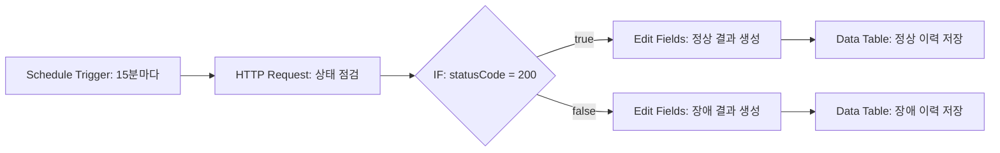

# 프로젝트 2 설계서 — 웹 서비스 자동 상태 점검 및 이력 기록

## 1. 반복 업무 정의

운영자가 정기적으로 웹 서비스 주소를 열어 정상 응답 여부를 확인하고 결과를 기록하는 업무를 자동화한다.

## 2. 도구 선정

n8n Community Edition을 사용한다.

선정 이유:

- Schedule Trigger로 정기 실행을 구성할 수 있다.
- HTTP Request와 IF 노드를 이용해 점검 및 분기를 시각적으로 구성할 수 있다.
- Data Table에 점검 이력을 내부 저장할 수 있다.
- 로컬 self-hosting으로 별도 유료 플랜 없이 반복 실행할 수 있다.
- 실행별 입력, 출력, 오류를 단계 단위로 확인하기 쉽다.

## 3. 워크플로우

## 4. 노드 구성

| 구분 | 노드 | 역할 |
|---|---|---|
| Trigger | Schedule Trigger | 15분마다 자동 실행 |
| Action 1 | HTTP Request | 점검 URL 호출 |
| Branch | IF | HTTP 상태 코드 200 여부 판정 |
| Action 2 | Edit Fields | 상태, 설명, 점검 시각 생성 |
| Action 3 | Data Table | 점검 이력 저장 |

HTTP Request는 4xx/5xx 응답에서도 워크플로우를 중단하지 않고 상태 코드를 다음 노드로 넘기도록 설정한다.

## 5. 저장 필드

| 필드 | 예시 |
|---|---|
| checked_at | 2026-07-13T09:00:00+09:00 |
| target_url | http://127.0.0.1:5678/healthz |
| status_code | 200 |
| result | NORMAL |
| detail | 서비스가 정상 응답했습니다. |

## 6. 테스트 케이스

| ID | 테스트 URL | 예상 상태 | 예상 분기 |
|---|---|---|---|
| P2-S | `http://127.0.0.1:5678/healthz` | 200 | 정상 |
| P2-F | `http://127.0.0.1:5678/this-path-does-not-exist` | 404 | 장애 |

실제 활성화 상태에서는 정상 URL을 사용한다. 장애 분기 증빙을 만들 때만 실패 URL로 바꿔 수동 실행하고, 증빙 후 정상 URL로 복구한다.

## 7. 보너스 확장안

- Error Trigger 기반 실패 알림 워크플로우 연결
- 장애 발생 시 이메일 또는 Discord 알림 전송
- 일시 오류의 경우 Wait 노드 후 한 차례 재시도

보너스 기능은 기본 요구사항을 모두 검증한 후 계정과 알림 채널이 준비되면 추가한다.
